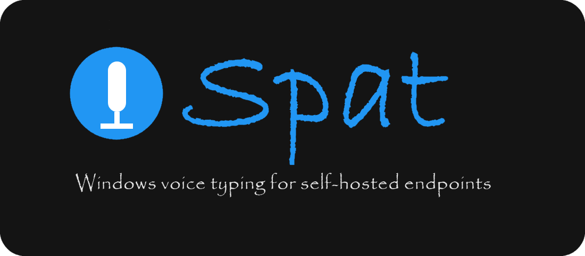

<p style="text-align:center;">
  
</p>

[](https://github.com/bitbound/spat/actions/workflows/test.yml)
[](LICENSE)

Spat is a small desktop utility for Windows. It records the microphone, sends the audio to an OpenAI-compatible speech endpoint, and types the result back as keystrokes into whatever window has focus.

> Unashamedly vibe-coded.  Inspired by [Handy](https://github.com/cjpais/Handy).

## Features

- A global hotkey that works while another app has focus.
- Tap the hotkey to start and stop, or hold it down to talk.
- Transcription through any endpoint that speaks the OpenAI `/v1/audio/transcriptions` API.
- An optional second pass through a text model to clean up the transcript before it gets typed.
- Text is injected with `SendInput`, so it lands in the focused application like typed keystrokes.
- A history of past dictations with optional recording playback.
- Ships as one self-contained single-file exe that updates itself in place from GitHub Releases.
- Light and dark themes that follow the Windows system color scheme.
- Optional start-on-login, toggled from Settings.

## Install

Download `spat-x64.exe` from the [latest release](https://github.com/bitbound/spat/releases/latest),
put it anywhere (for example `%LOCALAPPDATA%\Programs\spat\`), and run it. No installer and no
.NET install needed.

On launch Spat checks GitHub Releases. When a newer version exists, an **Update available** link
appears in the status bar; clicking it downloads the new build, swaps it over the running
executable, and relaunches — same location, same name, nothing to reinstall. Turn the check off
under **Settings → Check GitHub Releases for updates**.

The release also ships `spat-windows-x64-aot.zip`, a Native AOT build. It starts faster but updates
only by re-downloading the archive yourself, since the in-place updater targets the single-file exe.

Once Spat is running it lives in the system tray. Open **Settings**, fill in the sections below,
then press your hotkey and start talking.

## Requirements

- Windows 10 or later, x64.
- A microphone.

The global hotkey uses a low-level keyboard hook, and text injection uses `SendInput`. Neither
needs administrator rights. Spat never sees more of your keystrokes than the single key you bind
as its hotkey, and it stops watching that key entirely while another app has grabbed it.

## Setup

### Speech endpoint

**Settings → Speech to text.** Any OpenAI-compatible service works. Set the endpoint, the API key, and the model id. The endpoint placeholder suggests [Lemonade](https://lemonade-server.ai) at `http://localhost:13305/v1`. Click the refresh button next to the model field to pull the list from `/v1/models`.

Single-model servers that serve one transcription model chosen at startup and expose no `/v1/models` listing (for example [parakeet.cpp](https://github.com/mudler/parakeet.cpp) in its container form) work too. Untick **This server lists its models (/v1/models)** and the model field disappears, no model is required, and none is sent.

### Pick a hotkey

**Settings → Dictation → Set shortcut.** Press the combination you want. The default is `Ctrl+Alt+Space`. The trigger mode decides the behavior.

- **Tap** starts dictation on one press and stops it on the next.
- **Press** records only while the key is held down.

If another app already owns the combination, Spat keeps the old binding and shows a warning until
you change it.

### Tune recording

Also under **Settings → Dictation**.

| Setting | What it does |
| --- | --- |
| Microphone | Capture device. Refresh rescans what Windows exposes. |
| Max recording seconds | Hard stop for a single take. |
| Silence threshold | Below this level the take ends early. Raise it if background noise keeps a recording alive. |
| Typing delay | Pause between a key press and its release. 0 types the whole transcript in one burst; raise it if an app drops characters. |

### Optional post-processing

**Settings → Post-processing** sends the raw transcript through a chat model before typing it. This helps with punctuation, capitalization, and filler words. It takes its own endpoint, key, and model, so you can run a small local model for cleanup and keep the speech endpoint somewhere else.

### Start on login

Tick **Start Spat when I sign in to Windows** in Settings. It registers (or unregisters) a value
under `HKCU\Software\Microsoft\Windows\CurrentVersion\Run`.

## Files and Logs

| Path | Contents |
| --- | --- |
| `%APPDATA%\spat\settings.json` | Settings |
| `%APPDATA%\spat\prompts.json` | Post-processing prompts |
| `%APPDATA%\spat\logs\spat.log` | Log file |
| `%LOCALAPPDATA%\spat\history.json` | Dictation history |
| `%LOCALAPPDATA%\spat\audio\` | Saved recordings |

If something misbehaves, turn on **Settings → Diagnostics → Write debug logs**, reproduce the problem, then use **Open log file**.

## Building from Source

Requires the .NET 10 SDK.

```
dotnet build Spat.slnx
dotnet run --project Spat/Spat.csproj
```

Run the tests with:

```
dotnet run --project tests/Spat.Tests/Spat.Tests.csproj
```

## Publish Targets

### Release build (single-file, self-updating)

```
dotnet publish Spat/Spat.csproj -c Release -o ./artifacts
```

The project file carries the single-file defaults (`RuntimeIdentifier`, `SelfContained`,
`PublishSingleFile`, compression), so this yields one `spat.exe`. The release workflow renames it
to `spat-x64.exe` and publishes that as the GitHub Release asset; the in-app updater looks for
exactly that name (`ReleaseAssetSelector.AssetName`, pinned by a unit test).

### Native AOT

```
dotnet publish Spat/Spat.csproj -p:PublishProfile=nativeaot -c Release
```

Produces a single `spat.exe` (with three native Avalonia/Skia DLLs next to it). Needs the C++
toolchain from the Visual Studio "Desktop development with C++" workload; run it from a Developer
Command Prompt so the linker is found.

## License

Spat is licensed under the [GPL-3.0](LICENSE).
